## Language Conditioned Imitation Learning over Unstructured Data

### 1. Learning to follow natural language instructions from play

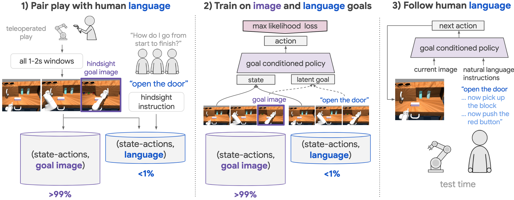

1) First, relabel teleoperated play into many image goal examples. Next, pair a small amount of play with hindsight instructions, yielding language goal examples.

2) Multicontext imitation: train a single policy on both image and language goals.

3) Test time: A single agent performs many skills in a row, directly from images, specified only in natural language.

### 2. Multicontext Imitation Learning

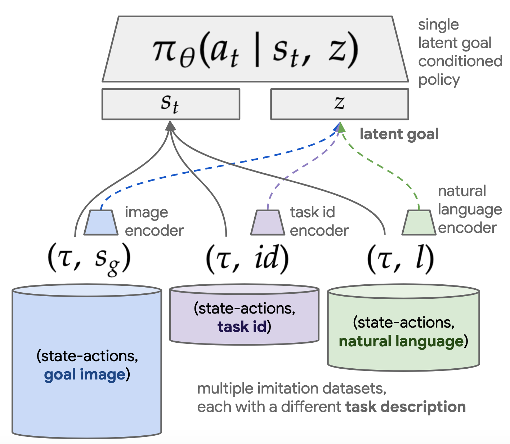

### 3. Comparing original goal image conditioned LfP (left) to goal image or natural language conditioned LangLfP (right)

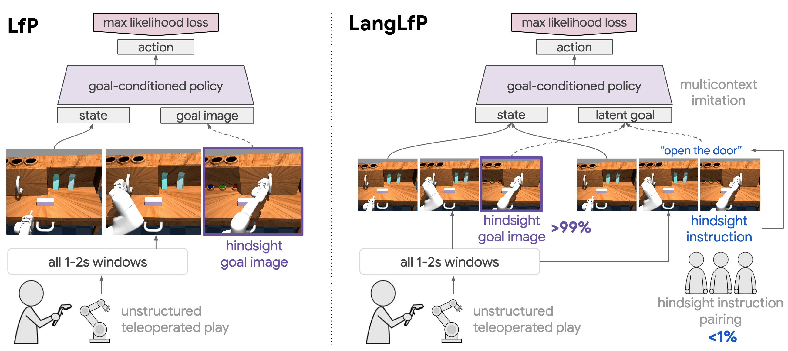

### 4. Following novel instructions at test time in zero shot using transfer learning

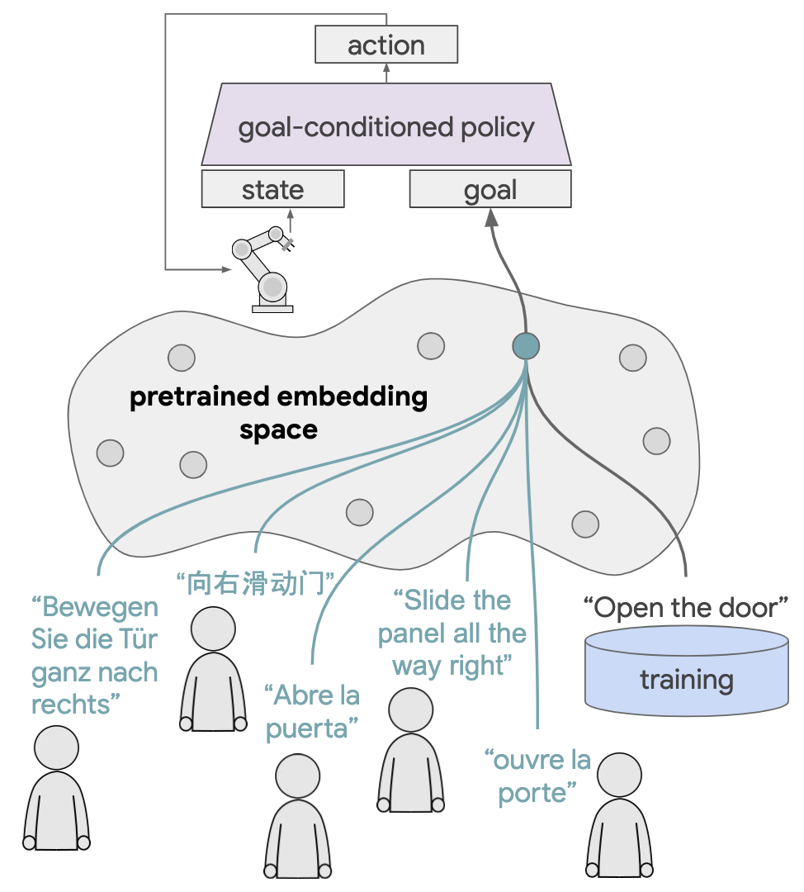

---------------------------------------------

## CALVIN: A Benchmark for Language-Conditioned Policy Learning for Long-Horizon Robot Manipulation Tasks

### Four key components of CALVIN

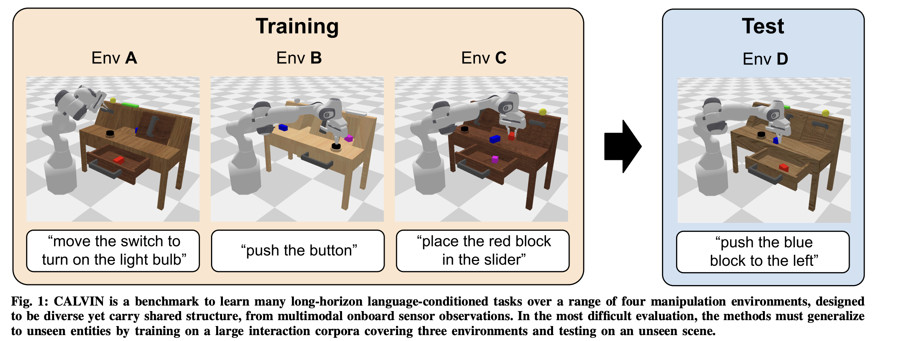

### Observation and action spaces for the CALVIN benchmark

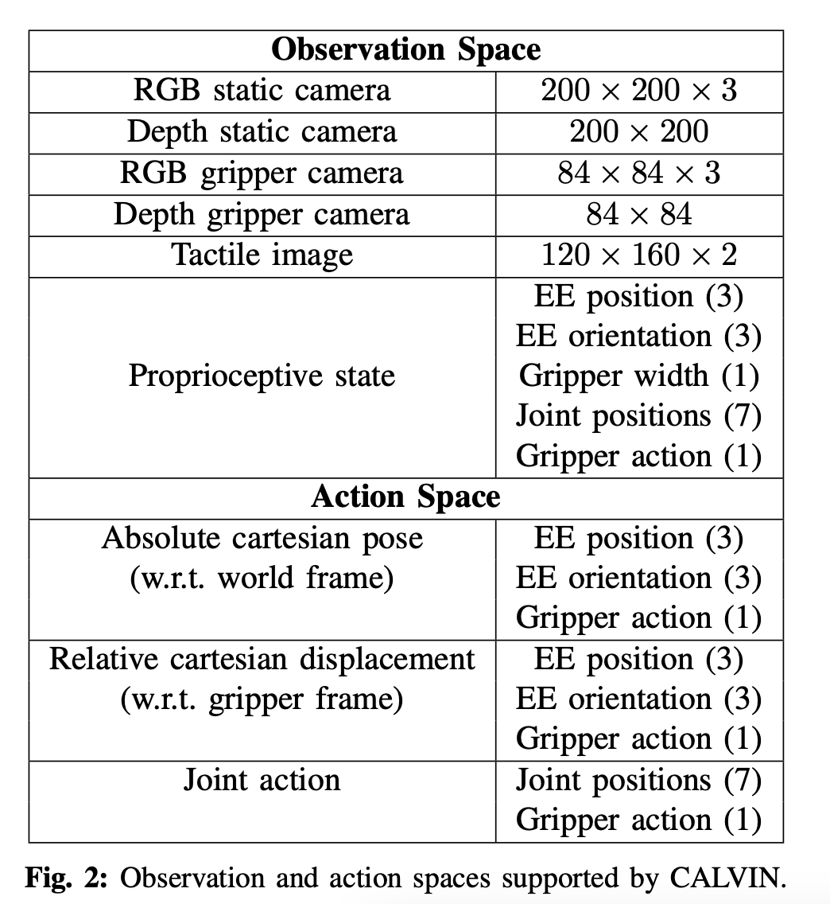

### Sensor and actuator suite for the CALVIN benchmark

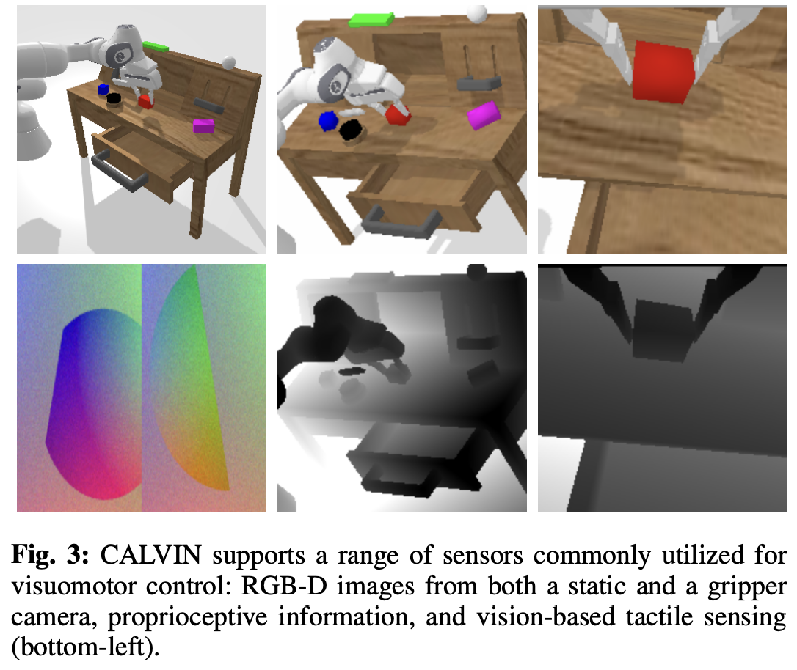

--------------------------

## [RoboFlamingo:Vision-Language Foundation Models as Effective Robot Imitators](https://roboflamingo.github.io/)

### 1.Comparison among RoboFlamingo and existing vision-language manipulation solutions

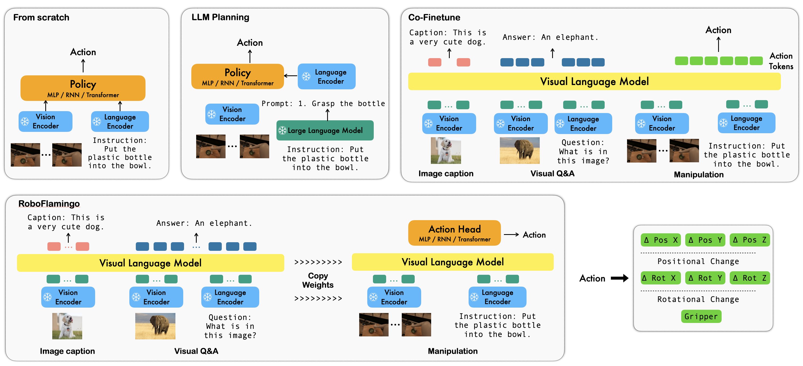

### 2. The proposed RoboFlamingo framework

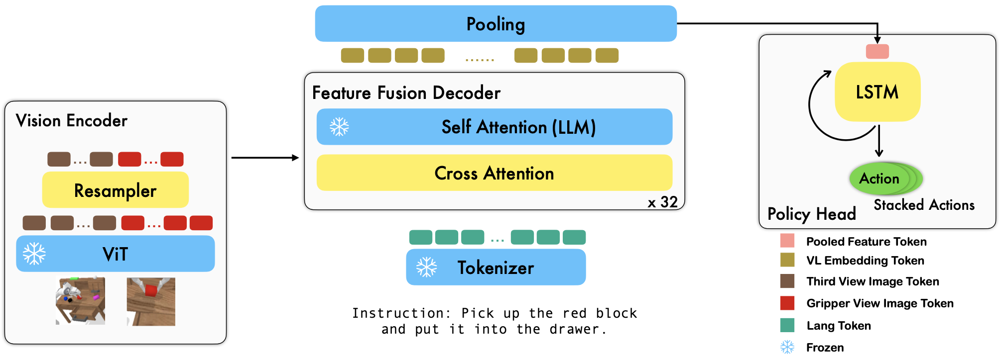

The output from the feature fusion decoder is trained as the representation of the vision observation and language instruction, which will be further translated into low-level control signals. To achieve this, we simply adopt an additional policy head to predict the action, e.g., the 7 DoF end-effector pose and gripper status. We test various strategies to model the historical observation sequences and behave as the policy head, e.g., a long short-term memory (LSTM) network with an MLP for the final prediction; a decoder-only transformer with an predictive MLP; or a single MLP that only models single-step information, etc.

----------------------------------------------

## [GR-1: UNLEASHING LARGE-SCALE VIDEO GENERATIVE PRE-TRAINING FOR VISUAL ROBOT MANIPULATION](https://gr1-manipulation.github.io/)

### 1. GR-1 Overview

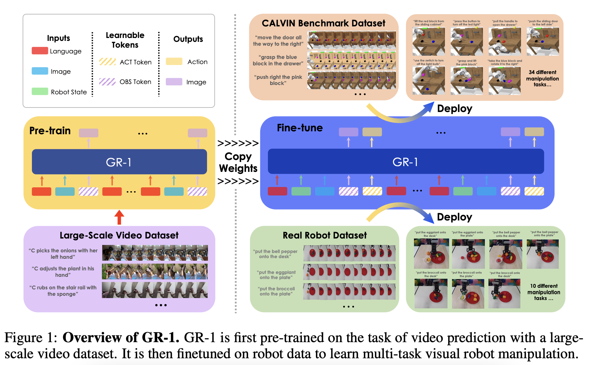

### 2. Encoder and Decoder
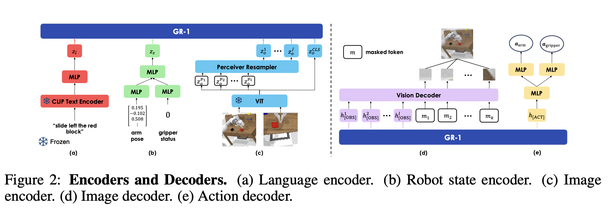

### 3. Tranining 
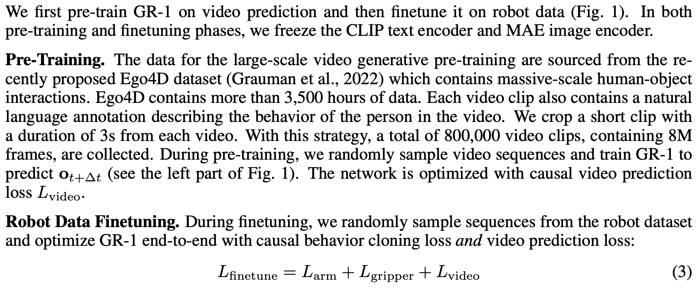

----------------------------------------------
##  [GR-2: A Generative Video-Language-Action Model with Web-Scale Knowledge for Robot Manipulation](https://gr2-manipulation.github.io/)

### Overview
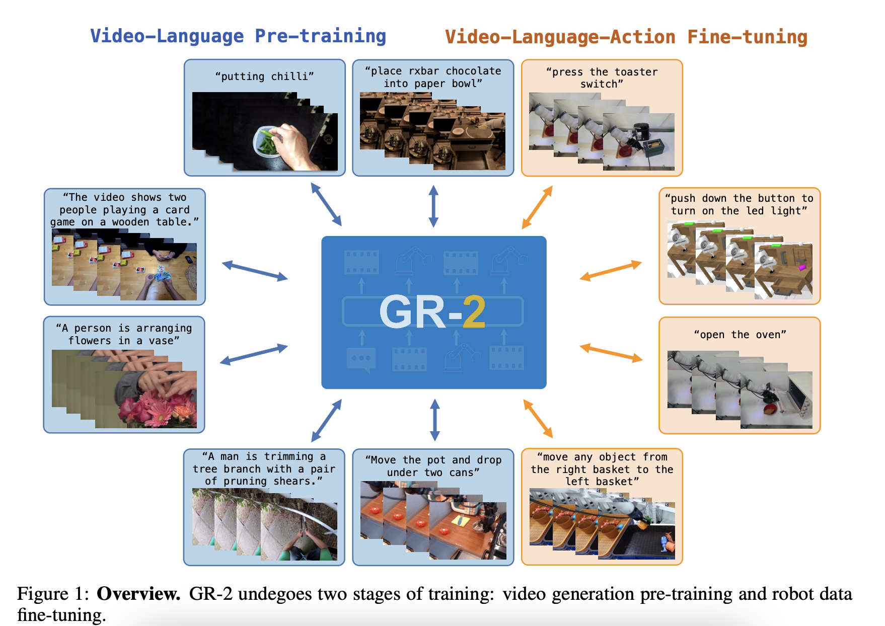
This large-scale pre-training, involving 38 million video clips and over 50 billion tokens, equips GR-2 with the ability to generalize across a wide range of robotic tasks and environments during subsequent policy learning

### Video
[GR-2 Video](https://www.youtube.com/watch?v=FHH0r_QUmyo)

### Benchmark

-------------------------------------------
## [RoboUniView： Visual-Language Model with Unified View Representation for Robotic Manipulation](https://liufanfanlff.github.io/RoboUniview.github.io/)

### 1. Background

To integrate LLM into robotic control systems, there are two main approaches:

1) Utilize prompt tuning of out-of-the-box LLMs and Vision-Language (VL) models for zero-shot planning and task decomposition, which is subsequently executed by a low-level controller. These methods require intricate prompt tuning and stragetic logic.
2) Focus on imitation learning or reinforcement learning,using extensive robotic datasets.n. However, existing methods exhibit significant performance disparities across different robotic platforms about this approach. One of the main reasons is the differences in camera specifications and installation positions, which make it difficult for the models to accurately understand the real physical space from varied images, thus affecting the accuracy of their action predictions

### 2. The RoboUniView Architecture 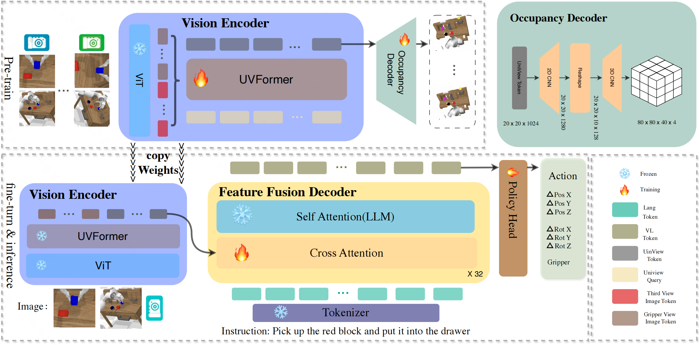

### 3. UVFormer

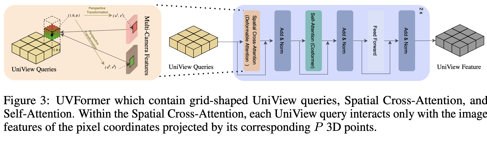
